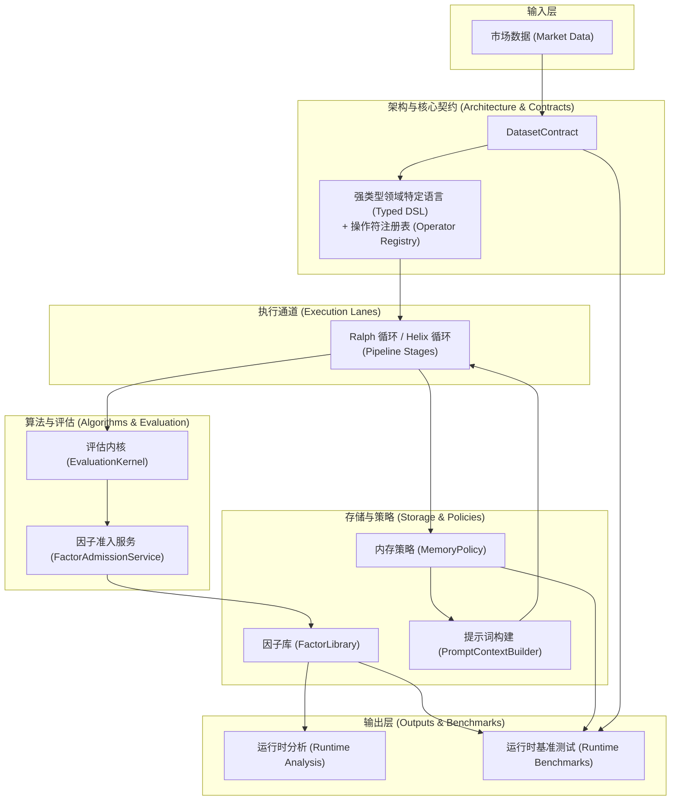
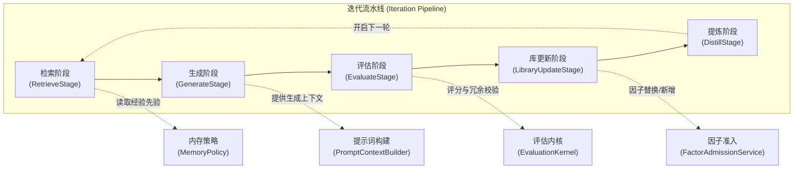
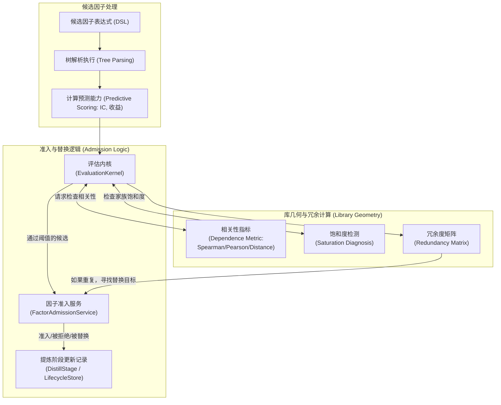
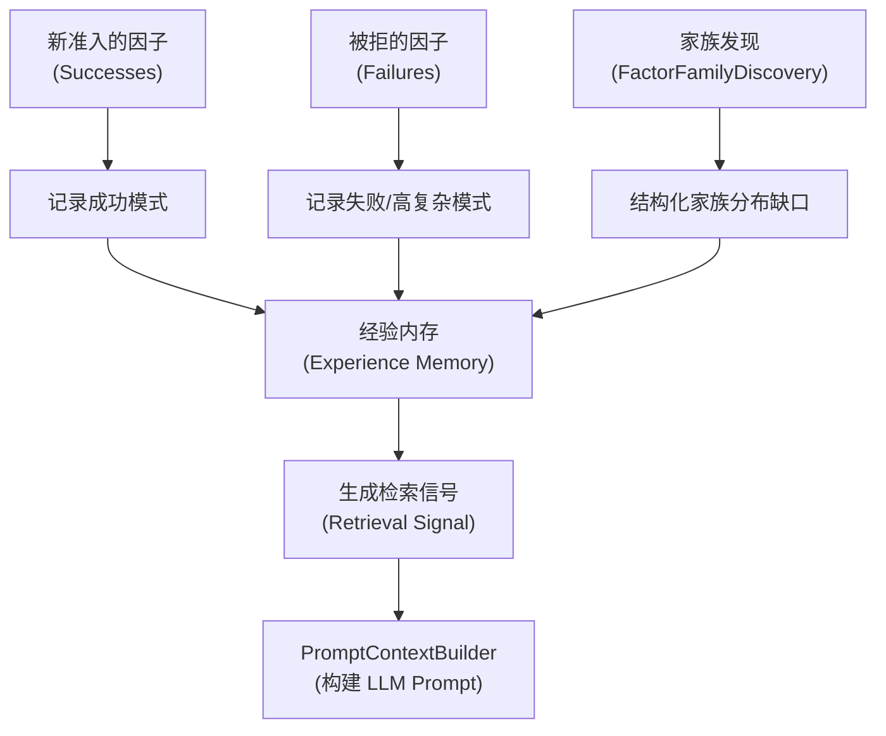

# FactorMiner 项目架构与算法关系图

本文档提供了 FactorMiner 的整体系统架构图和核心算法流程的关系图。所有图表均使用 Mermaid 语法生成。

## 1. 系统整体架构图

该图展示了 FactorMiner 中数据、核心循环、内存策略、评估以及分析/基准测试模块之间的总体依赖关系。

## 2. 阶段执行流水线 (Stage Pipeline)

展示了单个因子挖掘迭代 (Iteration) 内五个核心阶段的顺序流转以及它们与外围服务的交互。

## 3. 算法层内部关系图

展示了具体算法（评价内核、几何学、准入机制）之间的复杂协同工作模式，包括如何通过指标（IC/Distance/Spearman）对因子进行过滤与筛选。

## 4. 经验内存进化图 (Memory Evolution)

描述 MemoryPolicy 如何将各个阶段的经验提取、演化并输入给下一轮。

